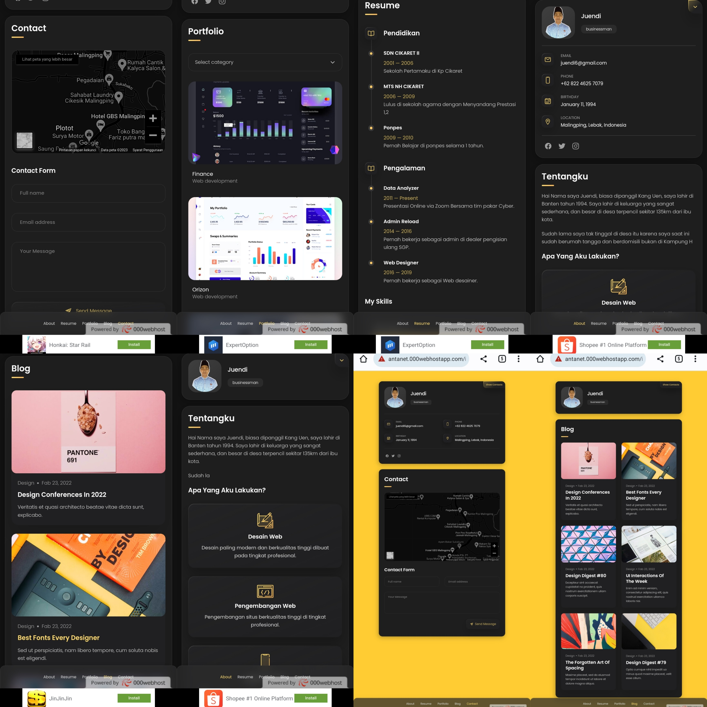

# Aplikasi Website Pribadi dengan Sistem Database dan PHP

## Deskripsi

Aplikasi ini adalah sebuah website pribadi yang dibangun dengan menggunakan PHP dan sistem database. Website ini memungkinkan Anda untuk mengelola konten dan tampilan halaman melalui basis data. Anda dapat dengan mudah mengubah dan mengedit konten pada halaman website tanpa harus merubah kode secara langsung.

## Cara Install

1. Download source kode dari [sini](https://drive.google.com/file/d/1ALYn3mL46moL23gTXMnzVOQ-veO0MarG/view?usp=drivesdk) atau melalui [Google Drive](https://drive.google.com/file/d/1ALYn3mL46moL23gTXMnzVOQ-veO0MarG/view?usp=drivesdk).
2. Ekstrak file yang diunduh ke direktori MySQL atau hosting Anda.
3. Dump atau impor basis data dengan nama `DatabaseWebProfile.sql`.
4. Buka berkas `index.php` untuk melihat tampilan website Anda.

## Mengedit Konten

Jika Anda ingin mengubah konten atau skrip pada website, ikuti langkah berikut:

1. Buka database Anda dan akses tabel `website_sections`.
2. Temukan baris yang berisi konten yang ingin diubah.
3. Edit kolom `section_name` dan `section_code` sesuai kebutuhan.

### Lokasi Konten

- Gambar: Lokasi gambar yang digunakan berada di folder `assets/images`.
- JavaScript: Skrip JavaScript dapat ditemukan di berkas `assets/js/script.js`.
- CSS: Skrip CSS yang mengatur tampilan website berada di berkas `assets/css/style.css`.

## Kontribusi

Anda dapat berkontribusi pada proyek ini dengan mengajukan _pull request_ ke repository ini.

## Kontak

Jika Anda memiliki pertanyaan atau masukan, jangan ragu untuk menghubungi kami di [alamat email ini](mailto:uen.csr@gmail.com).

Terima kasih telah menggunakan Aplikasi Website Pribadi ini!
